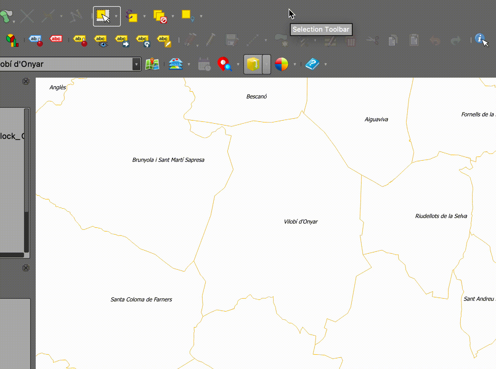
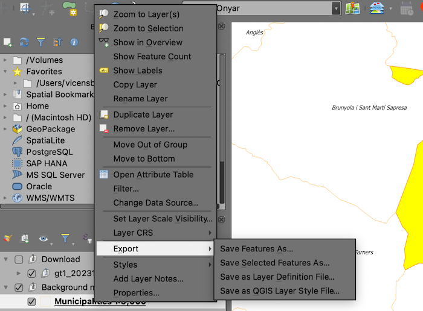

# TUTORIAL PER A LA CREACIÓ D'UN MAPA GEOLÒGIC AMB QGIS

A continuació, s'explica com crear un mapa geològic pas a pas, utilizant el software **QGIS** i el complement **Open ICGC**.

## Configurar QGIS

1. En primer lloc caldrà obrir QGIS, i crear un nou projecte en blanc tot configurant el sistema de referencia de coordenades amb el codi **EPSG 25831** (UTM 31N ETRS 89).

2. A continuació, en cas que no ho hagis fet abans, caldrà instalar el complement **Open ICGC**. Per a fer-ho cal dirigir-se al menú *Plugins > Manage and Install pluguins...* i a la finestra emergent, dins de l'apartat *Search*, escriure **Open ICGC**. Una vegada filtrats els resultats, caldrà seleccionar el complement en qüestió i fer un clic sobre el botó *Install plugin*.

3. El nou complement apareixerà en forma de nova barra d'eines, a la interfície gràfica de QGIS.

### Descarregar la cartografia de treball

4. En primer lloc, caldrà descarregar la base municipal de tot Catalunya. Dirigeix-te a la barra d'eines que acabes d'instal·lar i fes un clic sobre el botó *Background maps* per accedir al catàleg de dades que ofereix el complement. Desplaça't pel menú *Background maps > Administrative divisions > Municipalities > Municipalities 1:5000*

   
5. A continuació centraràs la vista sobre el terme municipal de Viulobí d'Onyar. Per a dur a terme aquesta acció, cal que situis el cursor dins de la caixa de cerca (*search*) del complement, i escriguis el nom del municipi. A continuació, prem la tecla retorn per tal d'obtenir el resultat de la cerca, selecciona la primera opció: **Cap de municipi**. Per tal de confirmar la selecció i centrar la vista al municipi, fes un clic a **ok**.

7. A continuació, caldrà que descarreguis la capa del mapa geològic 1:25.000 de Catalunya. Per a dur a terme aquesta acció, caldrà que a la barra d'eines del complement OpenICGC, facis un clic sobre la icona *Download tool* i accedeixis al menú *Geological map vectorial data > Geological map 1:25.000*. Abans d'iniciar la descàrrega, assegura't que el **CRS** de la vista és 25831 i, en el cas que mostri el valor 4326, canvia'l tal i com s'indica en el punt 1.

8. Per finalitzar el procés de descàrrega, el complement et demanarà en quina carpeta vols desar les dades. Crea'n una, assigna-li el nom que creguis oportú, i selecciona-la. En finalitzar el procés de descàrrega, el geològic 25k es carregarà automàticament a la finestra de mapa.

### Adequar l'extensió de les capes de geologia, a l'extensió del municipi

9. Degut a que únicament t'interessen aquelles capes que pertanyen al municipi de Vilobí d'Onyar, i per tal de no sobrecarregar l'ordinador gestionant una capa molt més gran del necessari, hauràs d'aplicar un geoprocés conegut com a **retall** o **clip**. Fixa't que, el mapa geològic es composa de diverses capes i com que l'eina de retall només pot actuar d'una capa en una capa, el retall el duràs a terme aplicant un procés per lots, o en *batch*.

10. En primer lloc, però, cal que obtinguis una geometria de tall. I aquesta geometria de tall és el polígon que representa l'extensió del municipi. Així doncs, caldrà que seleccionis el polígon de Vilobí, i el desis en un nova capa. Per a fer això, només cal que agafis l'eina de selecció, facis un clic sobre el polígon per tal que quedi ressaltat de color groc.

11. A continuació, cal que facis un clic amb el botó dret del ratolí sobre el nom de la capa, visible al panell de capes i, al menú contextual, activis l'opció **  

