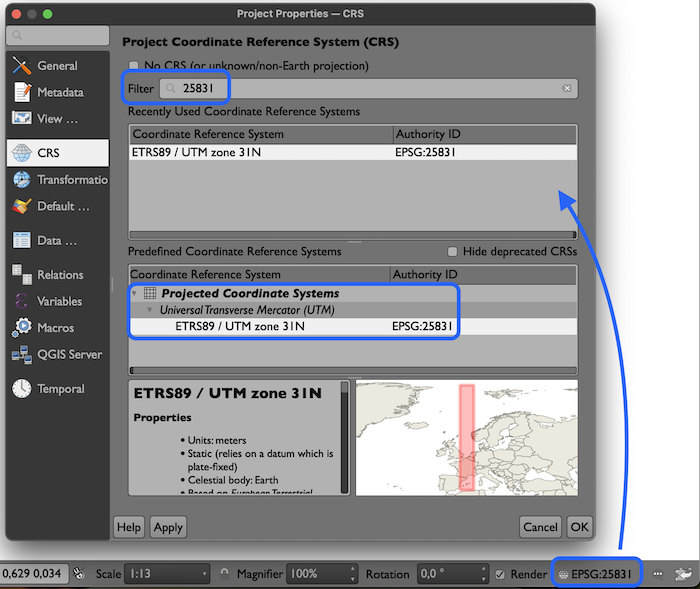
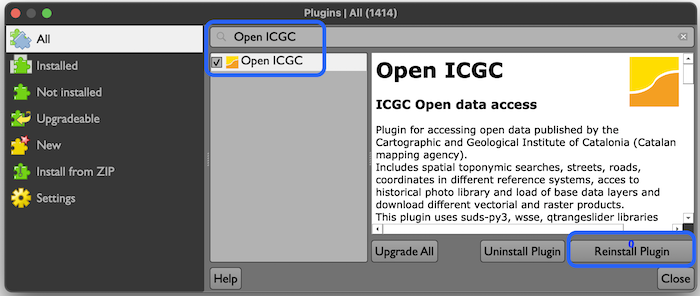
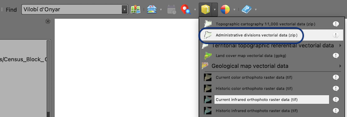
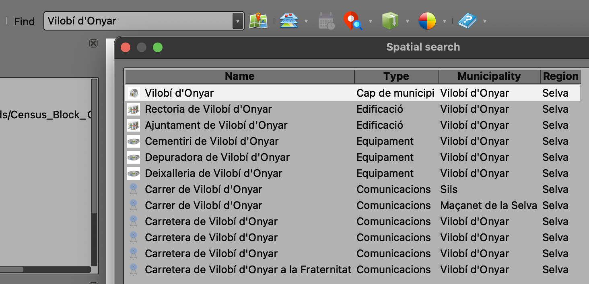
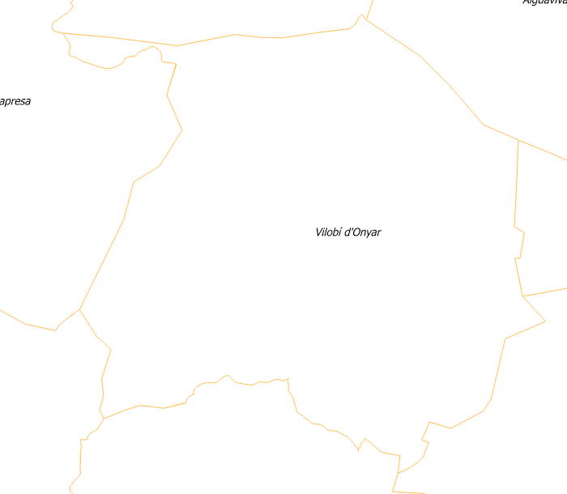
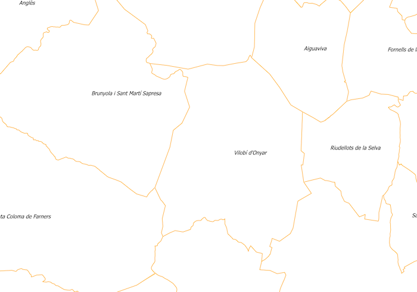
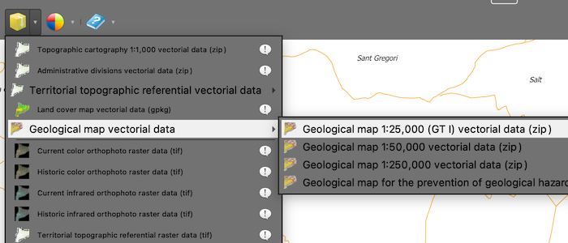
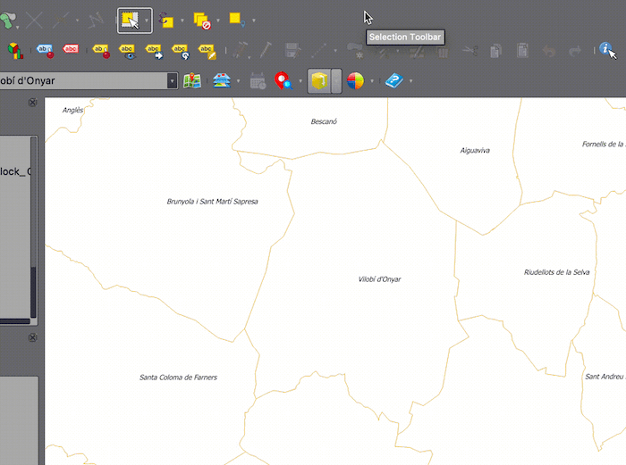
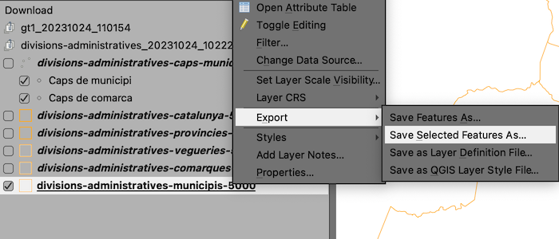
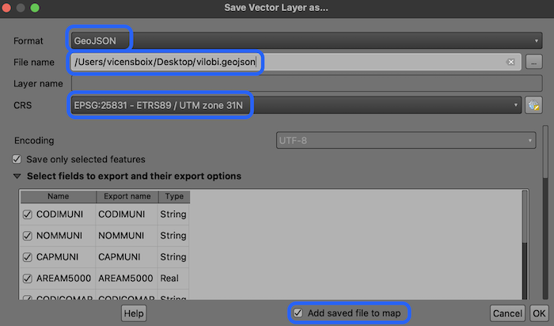

# TUTORIAL PER A LA CREACIÓ D'UN MAPA GEOLÒGIC AMB QGIS

A continuació, s'explica com crear un mapa geològic pas a pas, utilizant el software **QGIS** i el complement **Open ICGC**.

## 1. Configurar QGIS

1. En primer lloc caldrà obrir QGIS, i crear un nou projecte en blanc tot configurant el sistema de referencia de coordenades amb el codi **EPSG 25831** (UTM 31N ETRS 89).

2. A continuació, en cas que no ho hagis fet abans, caldrà instalar el complement **Open ICGC**. Per a fer-ho cal dirigir-se al menú *Plugins > Manage and Install pluguins...* i a la finestra emergent, dins de l'apartat *Search*, escriure **Open ICGC**. Una vegada filtrats els resultats, caldrà seleccionar el complement en qüestió i fer un clic sobre el botó *Install plugin*.

3. El nou complement apareixerà en forma de nova barra d'eines, a la interfície gràfica de QGIS.

### 2. Descarregar la cartografia de treball

4. En primer lloc, caldrà descarregar la base municipal de tot Catalunya. Dirigeix-te a la barra d'eines que acabes d'instal·lar i fes un clic sobre el botó *Download tool* per accedir al catàleg de dades que ofereix el complement. Desplaça't pel menú *Download tool > Administrative divisions vectorial data (zip)*.

5.  En la finestra emergent, fes un clic sobre el botó **Ok** per descarregar les dades de Catalunya, tot donant un nom (o deixant el que apareix per defecte) a la carpeta on es descarregaran les dades. Espera a que finalizi el procés de descàrrega.

6. Les dades relatives a les divisions administratives de Catalunya es mostraran al panel de capes de QGIS, on podràs veure que s'han descarregat els límits corresponents a municipis, comarques, vegueries, províncies i país. Descativa totes les capes a excepció dels límits municipals:

   
7. Com que les capes están configurades per tal que es mostrin segons l'escala de visualizatció, és possible que no vegis res a la finestra de mapa. No cal que et preocupis doncs a continuació es mostraran. Ara centraràs la vista sobre el terme municipal de Vilobí d'Onyar. Per a dur a terme aquesta acció, cal que situis el cursor dins de la caixa de cerca (*search*) del complement, i escriguis el nom del municipi. A continuació, prem la tecla retorn per tal d'obtenir el resultat de la cerca, selecciona la primera opció: **Cap de municipi**. Per tal de confirmar la selecció i centrar la vista al municipi, fes un clic a **ok**.

8. A la finstra de mapa hi apareixerà el nom del municipi però no els límits, degut a que la vista està a escala 1:1.000, ara mateix. Si amb la rodeta central del ratolí allunyes la vista, veuràs com ara sí apareix el límit del municipi, així com de la resta de municipis veins.

   
9. A continuació, caldrà que descarreguis la capa del mapa geològic 1:25.000 de Catalunya. Per a dur a terme aquesta acció, caldrà que a la barra d'eines del complement OpenICGC, facis un clic sobre la icona *Download tool* i accedeixis al menú *Geological map vectorial data > Geological map 1:25.000*. 

10. Per finalitzar el procés de descàrrega, el complement et demanarà en quina carpeta vols desar les dades. Crea'n una, assigna-li el nom que creguis oportú, i selecciona-la. En finalitzar el procés de descàrrega, el geològic 25k es carregarà automàticament a la finestra de mapa.

### 3. Adequar l'extensió de les capes de geologia, a l'extensió del municipi

11. Degut a que únicament t'interessen aquelles capes que pertanyen al municipi de Vilobí d'Onyar, i per tal de no sobrecarregar l'ordinador gestionant una capa molt més gran del necessari, hauràs d'aplicar un geoprocés conegut com a **retall** o **clip**. Fixa't que, el mapa geològic es composa de diverses capes i com que l'eina de retall només pot actuar d'una capa en una capa, el retall el duràs a terme aplicant un procés per lots, o en *batch*.

12. En primer lloc, però, cal que obtinguis una geometria de retall. I aquesta geometria de retall és el polígon que representa l'extensió del municipi. Així doncs, caldrà que seleccionis el polígon de Vilobí de la capa de límits municipals, i el desis en un nova capa. Per a fer això, només cal que tinguis seleccionada la capa de municipis al panell de capes, agafis l'eina de selecció, i facis un clic sobre el polígon per tal que quedi ressaltat de color groc.

13. A continuació, cal que facis un clic amb el botó dret del ratolí sobre el nom de la capa, visible al panell de capes i, al menú contextual, activis l'opció **Export > Save selected features as...*.

14. En el quadre de diàleg emergent, caldrà que seleccionis el format de sortida de la nova capa (**geojson**), una ubicació i un nom (p.e. **vilobi**). També caldrà indicar que el CRS de la capa ha de ser EPSG:25831. Finalment, assegurar-se que la casella *Add saved file to map* està activada.  

15. En finalitzar el procés, al panell de capes hi apareixerà una nova capa que durà per nom **vilobi** amb un únic polígon. A continuació, pots eliminar del panell de capes totes les capes a excepció de la que acabes de crear, així com les capes del mapa geològic.

16. Per tal de retallar les 11 capes del geològic amb el contorn del terme municipal de vilobí, activa el menú *Vector > Geoprocessing tools > Clip...*. En la finestra emergent, fes un clic sobre el botó *Run as batch process*. Aquesta nova finestra compta amb tres columnes que caldria omplir adequadament per tal de poder fer tots els retalls a la vegada. Les columnes a parametritzar són *Input layer* (o la capa que es vol retallar), *Overlay layer* (o la capa que es vol fer servir com a contorn per al retall) i *Clipped* (que serà la capa de sortida una vegada aplicat el retall).

17. Per començar, faràs un clic sobre el botó *Autofill...* de la columna input layer i d'entre les diferents opcions, selecciona **Select from Open Layers**. A la finestra emergent, seleccionaràs les onze capes del geològic, i acceptaràs la selecció fent clic a **Ok**. 

18. A continuació, a la columna *Overlay layer*, selecciona la capa **vilobi** al primer registre i a continuació, fes un clic sobre el botó *Autofill...* i selecciona la opció *Fill down*. La finestra de l'eina presentarà el següent aspecte:

19. Per acabar, a la columna *Clipped*, fes un clic sobre el botó que mostra els tres punts, i en la finestra emergent, assigna el nom de la capa de sortida i que en realitat utilitzaràs com a prefix (p.e. **vilobi_**) i en acceptar, a la nova finestra que apareixerà (*Autofill settings*) escolliràs l'opció *Fill with parameter values* i com a paràmetres a usar, escull la opció que duu per nom *Input layer*.

20. Una vegada configurat tot el quadre, hauria de presentar el següent aspecte:

21. Abans de donar per finalitzat el procés, assegura't que tinguis activada la casella *Load layers on completion* i fes clic al botó *Run*.

22.  
