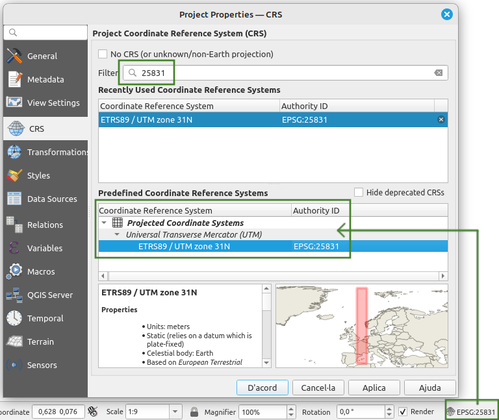
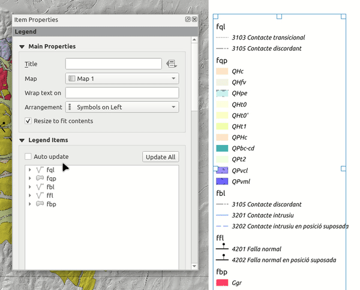
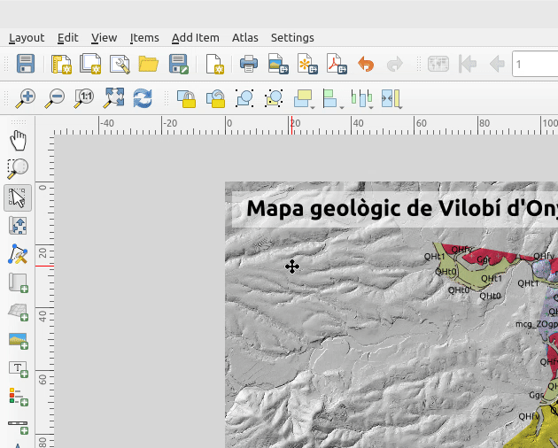

# TUTORIAL PER A LA CREACIÓ D'UN MAPA GEOLÒGIC AMB QGIS

A continuació, es mostra com dissenyar un mapa geològic pas a pas, utilizant el software **QGIS** i el complement **Open ICGC**. El dissenyador de mapes de QGIS ofereix moltes possibilitats i permet el disseny de cartografies complexes i de qualitat editorial. En aquest cas, però, es tracta de treballar amb les eines més elementals per tal d'elaborar un mapa senzill però que incorpori bona part dels elements indipensables de qualsevol cartografia.

## 1. Configurar QGIS

1. En primer lloc, obre QGIS, i crea un nou projecte en blanc tot configurant el sistema de referència de coordenades, amb el codi **EPSG 25831** (UTM 31N ETRS 89).

2. A continuació, sinó ho has fet abans, cal que instal·lis el complement **Open ICGC**. Per a fer-ho, vés al menú *Plugins > Manage and Install pluguins...* i a la finestra emergent, dins de l'apartat *Search*, escriu **Open ICGC**. Una vegada filtrats els resultats, selecciona el complement en qüestió i fes un clic sobre el botó *Install plugin*.

3. El nou complement apareixerà en forma de nova barra d'eines, a la interfície gràfica de QGIS.

### 2. Descarregar la cartografia de treball

4. El següent pas consistirà en descarregar la base municipal de tot Catalunya. Dirigeix-te a la barra d'eines que acabes d'instal·lar i fes un clic sobre el botó *Download tool* per accedir al catàleg de dades que ofereix el complement. Activa el menú *Download tool > Administrative divisions vectorial data (zip)*.

5.  A la finestra emergent, fes un clic sobre el botó **Ok** per descarregar les divisions administratives de tot Catalunya, donant un nom (o deixant el que apareix per defecte) a la carpeta on es desaràn les dades. Espera a que finalizi el procés de descàrrega.

6. Les dades relatives a les divisions administratives de Catalunya descarregades, es mostren al panell de capes de QGIS. Ara disposes dels límits corresponents als municipis, comarques, vegueries, províncies i país. Desactiva totes les capes a excepció dels límits municipals.

7. Com que les capes están configurades per tal que es mostrin segons l'escala de visualització, és possible que no vegis res a la finestra de mapa. No cal que et preocupis. A continuació t'ensenyem com mostrar les capes. Primer, centra la vista al terme municipal de Vilobí d'Onyar. Per a fer-ho, sitúa el cursor dins de la caixa de cerca (*Search*) del complement **Open ICGC**, i escriu el nom del municipi. A continuació, prem la tecla retorn per tal d'obtenir el resultat de la cerca, i selecciona la primera opció que es mostra: **Cap de municipi**. Per tal de confirmar la selecció i centrar la vista al municipi en qüestió, fes un clic a **Ok**.

8. A la finestra de mapa hi apareixerà el nom del municipi però no els límits, degut a que la vista es troba a escala 1:1.000, ara mateix. Girant la rodeta central del ratolí, allunyaràs la vista (*zoom out*) i podràs comprovar como ara sí, ja apareix el límit del municipi així com els dels municipis veins.

   
9. A continuació, caldrà que descarreguis la capa del mapa geològic 1:25.000 de Catalunya. Per a fer-ho, fes un clic sobre la icona *Download tool* de la barra d'eines del **Open ICGC**, i dirigeix-te al menú *Geological map vectorial data > Geological map 1:25.000*. 

10. Per finalitzar el procés de descàrrega, el complement et demanarà a quina carpeta vols desar les dades. Crea'n una, assigna-li el nom que creguis oportú, i selecciona-la. En finalitzar el procés de descàrrega, el geològic 25k es carregarà automàticament a la finestra de mapa de QGIS.

### 3. Adequar l'extensió de les capes de geologia, a l'extensió del municipi

11. Tenint en compte que únicament t'interessa l'espai corresponent al municipi de Vilobí d'Onyar, i per tal de no sobrecarregar l'ordinador gestionant una capa molt més gran del necessari, aplicaràs un geoprocés conegut com a **retall** o **clip**. Fixa't que, el mapa geològic es composa de diverses capes i, com que l'eina de retall bàsica només pot actuar d'una capa en una capa, el retall caldrà que el facis aplicant un procés per **lots**, o en *batch*.

12. En primer lloc, necessites disposar d'una una geometria de retall. Aquesta geometria de retall serà el polígon que representa l'extensió del municipi. Així doncs, cal que seleccionis el polígon de Vilobí de la capa de límits municipals, i el desis en un nova capa. Per a fer-ho, només cal que seleccionis o marquis la capa de municipis al panell de capes, després agafa l'eina de selecció i fes un clic sobre el polígon per tal que quedi ressaltat de color groc.

13. A continuació, fes un clic amb el botó dret del ratolí sobre el nom de la capa al panell de capes i, al menú contextual que apareix, selecciona l'opció *Export > Save selected features as...*.

14. Al quadre de diàleg emergent, selecciona el format de sortida de la nova capa (**geojson**), una ubicació i un nom (p.e. **vilobi**). També cal indicar que el CRS de la capa serà **EPSG:25831**. Finalment, assegura't que la casella *Add saved file to map* està marcada.  

15. En finalitzar el procés, al panell de capes hi apareixerà una nova capa que durà per nom **vilobi** amb un únic polígon. A continuació, elimina del panell de capes totes les capes a excepció de la que acabes de crear, així com les capes del mapa geològic.

16. Per tal de retallar les onze capes del geològic amb el contorn del terme municipal de vilobí, activa el menú *Vector > Geoprocessing tools > Clip...*. A la finestra emergent, fes un clic sobre el botó *Run as batch process*. Aquesta nova finestra compta amb tres columnes que caldrà omplir adequadament per tal de poder fer tots els retalls a la vegada. Les columnes a parametritzar són *Input layer* (la capa que es vol retallar), *Overlay layer* (la capa que es vol fer servir com a contorn per al retall) i *Clipped* (la capa resultant del retall).

17. Per començar, fes un clic sobre el botó *Autofill...* de la columna **[Input layer]** i d'entre les diferents opcions, selecciona **Select from Open Layers**. A la finestra emergent, selecciona les onze capes del geològic, i accepta la selecció fent clic a **D'acord**. 

18. A continuació, a la columna **[Overlay layer]**, obre el desplegable de la primera línia, i selecciona la capa **vilobi**. Després, fes un clic sobre el botó *Autofill...* i selecciona l'opció *Fill down*.

19. Per acabar, a la columna **[Clipped]**, fes un clic sobre el botó que mostra els tres punts i, a la finestra emergent, assigna el nom de la capa de sortida (indica que el format sigui **geojson**). En realitat, el que faràs es definir un prefix (p.e. **vilobi_**) i en acceptar, a la nova finestra emergent (*Autofill settings*) caldrà que escullis l'opció *Fill with parameter values* i com a paràmetre a utilitzar, selecciona l'opció que duu per nom *Input layer*.

20. Una vegada configurada la totalitat de la finestra de l'eina, i abans de donar per finalitzat el procés, assegura't que tinguis activada la casella **Load layers on completion** i fixa't com molt probablement, la primera filera estigui repetida. Així doncs, caldrà que eliminis aquest primer registre i, a continuació, facis un clic sobre el botó **Run**.

21. La següent tasca que has de dur a terme, és la de colocar les capes en l'ordre adequat. Per tant, prenent com a referència l'ordre de les capes descarregades amb l'ajuda del complement de l'ICGC, es tracta de moure les capes retallades al nivell que li corresponen. Per a fer-ho, només cal que seleccionis la capa que vols desplaçar amunt o avall, fer-hi un clic i sense deixar anar el botó esquerre del ratolí, moure-la a la seva nova posició:

22. Tan bon punt tinguis totes les capes ven organitzades, pensa a desar el projecte per tal de fixar la seva posició dins del panell de capes.

23. A continuació, caldrà traspassar la simbologia original del mapa geològic a les capes que has retallat i que en carregar-se al panell de capes, ho fan per defecte segons una simbologia única. Per a traspassar la simbologia cal que moguis el cursor sobre cadascuna de les capes originals, facis un clic amb el botó dret del ratolí i seleccionis l'opció *Styles > Copy Styles ... > All Style Categories*. Amb l'estil copiat, mou ara el cursor a la capa retallada corresponent, fent de nou un clic amb el botó dret del ratolí, i seleccionant l'opció *Styles > Paste Styles ... > All Style Categories*

24. Aquesta operació l'hauràs de repetir tantes vegades com capes tinguis al teu panell de capes. En finalitzar, pots eliminar definitivament les capes originals del mapa geològic descarregat per a tot Catalunya, i deixar únicament al panell de capes, el terme municipal de Vilobí d'Onyar i les capes retallades.  

### 4. La preparació de la capa de geologia

25. El mapa geològic de Catalunya s'organitza i es serveix en fulls. I malgrat que el complement **Open ICGC** el serveix en una capa única, el seu origen és la distribució per full i és per això que un mateix polígon que pertanyi a dos fulls diferents, apareix tallat, mostrant un límit que realment no existeix:

 
26. Per tal de solucionar aquest contratemps, aplicaràs un nou geoprocessament que duu per nom **Dissolve** o dissolució, i que et permetrà fusionar en una única entitat, tots aquells polígons que comparteixen idèntics atributs. En primer lloc doncs, activaràs la capa que duu per nom **vilobi_gt125mv10sh0fqp1r010_202101** i a continuació, aniràs al menú *Vector > Geoprocessing Tools > Dissolve ...*. 

27. A la finestra emergent, com a *input layer* escolliràs la capa **vilobi_gt125mv10sh0fqp1r010_202101** que és la que hauria d'aparèixer per defecte si l'has seleccionat al panell de capes abans de cridar l'eina *Dissolve*. En l'apartat *Dissolve field(s)* selecciona la columna **[CODI_CAS]**. Obre l'apartat *Advanced Parameters* i activa la casella *Keep disjoint features separate* per tal de fusionar només aquelles entitats que compartint el mateix valor d'atribut a la columna indicada, a més estiguin en contacte. Deixa que la capa de sortida sigui una capa temporal, i executa l'eina.

28. La nova capa que apareixerà al panell de capes amb el nom **Dissolved**, es carrega amb simbologia única, per la qual cosa, la primera cosa que faràs és copiar la simbologia de la capa original i enganxar-la a la nova capa. Comprova que ara, en aquesta capa els polígons ja no estàn dividits en fulls:

 29. Aquesta capa ja està preparada per a utilitzar-la en una composició o disseny de mapa. Abans però, descarregaràs un model digital d'elevacions de la zona d'estudi per tal d'emprar aquesta capa com a referència i context. 
 
 30. Sitúa el cursor sobre la capa **temporal** que duu per nom **Dissolve**, i fes un clic sobre el botó dret del ratolí. Al menú emergent, escull l'opció *Make permanent* per tal de desar-la físicament al teu ordinador. Escull del format geojson, i assigna-li per exemple el nom **vilobi_fqp**.

31. Aprofita per actualitzar el nom de la capa (botó dret i *Rename layer* o bé, tecla *F2* i canvia el nom a **vilobi_fqp**). Després fés un clic amb el botó dret del ratolí sobre la mateixa capa i escull l'opció *Zoom to Layer(s)* per veure'n tota la seva extensió. L'escala de visualització estarà a l'entorn de 1:38000. Modifica-la manualment a 1:60000 per tal d'abarcar més territori.

31. A continuació vés de nou a la barra d'eines **Open ICGC** i desplega l'eina de descarrega. D'entre totes les opcions escull *Digital terrain model raster data > Digital model terrain 5m*. A la finestra emergent selecciona l'opció **Area** per definir la zona a descarregar i, a continuació, dibuixa un rectangle que sobrepassi els límits de la capa vectorial. Espera que finalitzi el procés de descàrrega i es mostri el model digital d'elevacions a la finestra de mapa.

### 5. La preparació del model digital d'elevacions

32. La següent tasca que duràs a terme és la de mofificar la paleta o l'aparença del model digital d'elevacions que acabes de descarregar i que per defecte, es mostra en una escala de colors de blancs i negres. Fes un doble clic sobre la capa raster per accedir a la finestra de les propietats, fes un clic sobre l'apartat **Symbology** i modifica els paràmetres de manera que a l'apartat *Render type* s'hi mostri l'opció **Hillshade**. En l'apartat *Layer Rendering*, paràmetre *Blending mode*, desplega les opcions possibles i escull **Multiply**. Finalment en l'apartat *Resampling*, modifica els valors de *Zoomed: in* i *out* a **Cubic**. Modifica també el valor del paràmetre *Oversampling* a **6**.

33. Finalment, i abans de passar al disseny del mapa, activa les capes **vilobi_gt125mv10sh0fbp1r010_202101**, **vilobi_gt125mv10sh0ffl1r010_202101**, **vilobi_gt125mv10sh0fbl1r010_202101** i **vilobi_gt125mv10sh0fql1r010_202101**. Assegura't que la capa **vilobi_fqp** queda per sota de **vilobi_gt125mv10sh0fql1r010_202101**. De fet, si vols pots reanomenar totes les capes anteriors a **fbp**, **ffl**, **fbl**, **fql** i **fqp**, i esborrar la resta de capes a excepció del límit municipal i el model digital d'elevacions, per tal que el teu panell de capes mostri el següent aspecte:

### 6. Dissenyar un mapa geològic

34. Per accedir al dissenyador de mapes de QGIS, cal fer-ho des del menú *Project > New Print Layout ...*. A la finestra flotant emergent, assigna un nom a la nova composició (p.e. **mapa1**), i accepta.

35. Automàticament apareixerà una nova finestra de QGIS, amb un llenç en blanc. Aquest és el marc de la teva composició. La primera tasca que cal configurar és el tamany o mida de la composició (p.e. Din A4), i la seva orientació (vertical o hortizontal). Per a poder configurar aquests aspectes, cal fer un clic sobre el disseny en blanc amb el botó dret del ratolí, i seleccionar l'opció *Page Properties*. Automàticament apareixerà una nova pestanya a la dreta de la finestra (*Item properties*) on indicaràs la mida i l'orientació.

36. A continuació, incorpora la vista de mapa al nou disseny. Per a fer-ho cal que seleccionis l'eina d'afegir mapa a la barra d'eines principal, i dibuixis l'espai que haurà d'ocupar en el context del disseny. En qualsevol moment, i sempre que sigui necessari, serà possible modificar les mides del *frame* que conté el mapa.

37. Una vegada incoporat el mapa, la següent tasca és ajustar-lo al requadre dibuixat. Aquesta és una qüestió que es pot resoldre mitjançant el valor relatiu a l'escala de visualizació. Per tant, cal que seleccionis el mapa per tal de poder accedir a les seves propietats, i modificar manualment l'escala de visualizatció al valor **1:50.000**.

38. La següent tasca que duràs a terme, seguint el mateix procediment que en el cas del mapa, és la incorporació de la llegenda. Primer dibuixaràs on ha d'anar situada la llegenda i, a continuació, en podràs modificar tots els aspectes que consideris oportuns.

39. La llegenda actual ocupa molt espai perquè mostra la totalitat dels elements, capes i categories presents al panell de capes. I aquesta llegenda està sincronitzada amb la vista principal de QGIS de manera que qualsevol modificació en els elements del panell de capes de QGIS, té una traslació directa sobre la llegenda de la composició. Per evitar aquest comportament i poder editar el contingut de la llegenda de manera manual, cal que en primer lloc desactivis la casella **Auto update**.

40. Desmarcada la casella anterior, ara ja pots eliminar algunes de les capes i entrades que no cal que es vegin a la llegenda. Aquest és el cas del grup *Download*, la capa relativa al model digital d'elevacions, o el terme municipal del municipi. Per a eliminar-los, només cal que seleccionis l'element que vols treure de la llegenda, i facis un clic sobre la icona que mostra un signe negatiu de color vermell. A més, activaràs la casella *Only show items inside linked maps* per tal de filtrar el contingut de les capes i que només es mostrin aquelles categories presents en les capes que es veuen al mapa. Recorda que la capa original es de tot Catalunya i per tant, aquesta conté moltes categories que no estan presents a la teva imatge i allarguen innecessàriament la llegenda .

41. A continuació, pots afegir un nom a la llegenda, i modificar la mida dels textos que la composen.

42. També pots modificar els noms dels elements que hi apareixen:

43. Una vegada hagis editat els noms de les capes d'entrada presents a la llegenda, és més que probable que hagis de mofificar la mida del text per tal d'ajustar-lo a l'espai de que es disposa. En qualsevol cas, convé tenir present que, sempre que sigui necessari, es poden reajustar tots els elements per tal de ubicar-los de la millor manera possible al mapa.

44. A banda de la llegenda, existeixen també un parell d'elements bàsics en qualsevol cartografia, com són l'escala del mapa i la fletxa de nord. Així que en primer lloc, dibuixaràs un rectangle que contindrà els dos elements per posteriorment, incorporar-los, l'un rere l'altre.

45. Ara sí, una vegada incorporats tots tres elements, es tracta de jugar amb les seves propietats per tal d'integrar-los de la millor manera possible.

46. Primer ajustaràs el rectangle per tal que els elements que conté, tinguin prou espai. Això farà que primer hagis de desplaçar lleugerament la cartografia, per evitar possibles solapaments entre elements.

47. A continuació, ajustaràs els paràmetres relatius a la barra d'escala, tot definint-ne les unitats, el nombre de divisions a dreta i esquerra, la mida del text, ...

48. Després, serà el torn de la fletxa de nord, que podràs escollir quin model vols utilitzar, així com la seva mida i ubicació.

49. Ajusta tots els elements per tal que la composició sigui la més adequada possible.

50. Per tal de donar per acabada aquesta primera composició de mapa, amb els elements bàsics i indispensables, afegiràs un títol al teu mapa.

51. Ajusta'n les seves característiques i propietats abans de donar per acabada la composició o disseny.

52. Finalment, només resta saber que podràs exportar el teu mapa a imatge, o bé a PDF:

----